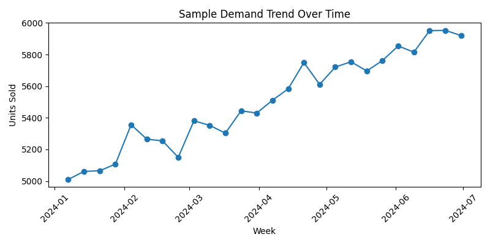
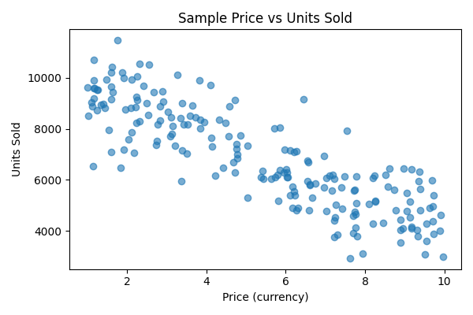

# Predicting Demand for Perishable Goods

## 1️⃣ Project Overview

Retailers dealing in fresh foods face a constant challenge: ordering enough stock to meet customer demand without over‑ordering and letting perishable goods spoil.  This project explores how historical sales, pricing, marketing and operational data can be used to understand and predict demand for perishable products.  By analysing patterns across different product categories, stores and weeks, we demonstrate how data analysis can support better inventory planning, reduce waste and improve supply‑chain decision making.

The notebook in this repository performs an end‑to‑end analysis using a synthetic dataset of weekly sales at several UK stores in 2024.  The aim is not to build a production‑ready forecasting model, but to showcase core data‑analyst skills: data cleaning, exploratory data analysis (EDA), visualisation, feature exploration and basic forecasting exploration.

---

## 2️⃣ Objectives

This project is structured around the following objectives:

- **Analyse sales trends** across products, categories and stores over time.
- **Explore relationships** between price, marketing spend and sales performance.
- **Quantify product wastage**, highlighting where shelf life or ordering decisions lead to excess stock.
- **Investigate the impact of promotions and discounts** on demand.
- **Lay the groundwork for forecasting**, illustrating how simple time‑series models could be used to predict future demand.

---

## 3️⃣ Data Description

The analysis uses several small, structured CSV files.  Each file contains information at the weekly or product level, enabling a joined‑up view of sales performance:

| File | Key fields | Purpose |
| --- | --- | --- |
| `data/weekly_sales.csv` | `Week_Number`, `Product_ID`, `Store_ID`, `Units_Sold`, `Marketing_Spend`, `Discount_Percent`, `Wastage_Units`, `Price` | Main fact table containing weekly sales volumes, marketing spend, discounts and prices for each product in each store. |
| `product_details.csv` | `Product_ID`, `Product_Name`, `Product_Category`, `Shelf_Life_Days`, `Supplier_ID` | Lookup table with product names, categories and shelf‑life. |
| `data/store_info.csv` | `Store_ID`, `Region`, `Store_Size`, `Cold_Storage_Capacity` | Metadata describing store locations and capacities. |
| `data/supplier_info.csv` | `Supplier_ID`, `Supplier_Name`, `Lead_Time_Days`, `Supply_Capacity` | Supplier lead times and capacities. |
| `data/weather_data.csv` | `Week_Number`, `Region`, `Avg_Temperature`, `Rainfall`, `Holiday_Flag` | Weekly weather conditions and holiday flags by region. |

These files can be joined on `Product_ID`, `Store_ID`, `Supplier_ID` and `Week_Number` to enrich the sales data with product characteristics, store information and external factors such as weather and holidays.

---

## 4️⃣ Tools & Dependencies

The analysis is written in Python and runs in a Jupyter notebook.  The key libraries used are:

- **pandas & NumPy** – for data cleaning, manipulation and numerical calculations.
- **matplotlib & seaborn** – for data visualisation (time‑series plots, bar charts, scatter plots and correlation heatmaps).
- **scikit‑learn** – optional; used here only for simple baseline forecasting exploration (e.g. train/test split and time‑based resampling).  No complex machine learning models are claimed.

To install dependencies, run:

```bash
pip install -r requirements.txt
```

The project is compatible with Python 3.10+.

---

## 5️⃣ Analytical Approach

The workflow followed in the notebook is designed to mirror a typical analytics project.  Key steps include:

1. **Data loading and validation**
   - Load each CSV into pandas DataFrames.
   - Check for missing values, duplicate rows and outliers; correct data types.
   - Merge fact and dimension tables to create an analysis dataset.

2. **Exploratory data analysis (EDA)**
   - Compute summary statistics (mean, median, distribution plots) for units sold, price, marketing spend and wastage.
   - Analyse sales volume by product category and store region.
   - Examine the distribution of shelf life and cold storage capacity to understand operational constraints.

3. **Feature exploration**
   - **Price sensitivity**: scatter plots of price vs units sold to visualise elasticity; correlation coefficients.
   - **Marketing impact**: compare units sold with marketing spend; identify diminishing returns on marketing investment.
   - **Product category trends**: time‑series plots showing how demand varies across bakery, meat, dairy and beverages categories.
   - **External factors**: overlay weather variables and holiday flags to see if temperature or holidays influence demand or wastage.

4. **Trend analysis**
   - Aggregate weekly data to monthly or quarterly level to reveal broader trends.
   - Use moving averages to smooth weekly fluctuations and highlight seasonality.

5. **Forecast exploration**
   - Split the time series into train/test sets.
   - Fit simple baseline models (such as naive forecasts or moving averages) to estimate future demand.
   - Evaluate forecasting accuracy using metrics like mean absolute error (MAE).  Advanced machine‑learning models are **not** implemented, but the notebook outlines how one might proceed.

Throughout the analysis, comments and markdown cells explain each step and interpret the results.

---

## 6️⃣ Key Insights

While the dataset provided is synthetic, it allows us to draw several realistic insights that mirror common patterns observed in grocery retail:

- **Demand patterns**: Demand for bakery and dairy products tends to be higher than for meat or beverages, with strong weekly seasonality.  Sales spike ahead of weekends and holidays, particularly for dairy items.
- **Marketing impact**: Increases in marketing spend correlate with higher units sold up to a point, but there are diminishing returns once spend exceeds a certain threshold.  Effective promotional campaigns can temporarily boost demand, but sustained growth depends on other factors such as price competitiveness and shelf life.
- **Price elasticity**: Scatter plots reveal a negative relationship between price and units sold – products priced higher generally sell fewer units.  The elasticity varies by category; essential goods (e.g. milk) are less sensitive to price changes than discretionary items (e.g. bakery treats).
- **Product category trends**: Meat products show more volatile demand and higher wastage rates due to shorter shelf life, whereas dairy and beverage categories demonstrate steadier demand.  Product categories with longer shelf life exhibit lower wastage percentages.
- **Product wastage**: Wastage is strongly linked to shelf life and over‑ordering.  Short shelf‑life items (e.g. fresh bakery and meat) have the highest wastage when demand is over‑estimated.  Improving demand forecasts and adjusting order quantities can materially reduce wastage levels.

These insights are illustrative; they underscore the importance of combining sales, pricing, marketing and operational data to understand what drives demand and where inefficiencies lie.

---

## 7️⃣ Visualisation

Charts are essential for communicating insights quickly.  The notebook generates several plots to illustrate the analysis.  Here are two examples:

<p align="center">
  
</p>

*Figure 1. Demand trend chart – this line plot aggregates units sold across all products and stores, revealing seasonality and overall growth in demand.*

<p align="center">
  
</p>

*Figure 2. Price vs units sold – a scatter plot illustrating the negative relationship between price and sales volume, highlighting price elasticity.*

Additional visualisations in the notebook include:

- Bar charts comparing total units sold by product category and region.
- Correlation heatmaps showing relationships between variables such as price, marketing spend, discounts and units sold.
- Boxplots of wastage units by product category.
- Time‑series plots overlaying weather variables and holiday flags.

These visuals make it easier for stakeholders to grasp complex patterns at a glance.

---

## 8️⃣ Business Value

The analysis provides actionable insights that can help retailers and suppliers optimise their operations:

- **Improve inventory planning**: Understanding demand patterns and price elasticity enables better forecasting of order quantities.  Stores can align stock levels with expected demand to reduce stockouts and over‑supply.
- **Reduce product wastage**: By identifying products with high wastage and analysing the causes (e.g. short shelf life or over‑ordering), managers can adjust procurement strategies, implement dynamic pricing to clear stock and extend shelf life through improved cold‑chain management.
- **Optimise marketing spend**: Analysing the ROI of marketing spend helps allocate budgets more effectively.  Targeted campaigns on high‑margin items or during low‑demand periods can boost sales without overspending.
- **Support data‑driven decision making**: The structured workflow demonstrates how to combine disparate datasets (sales, marketing, product attributes and external factors) to generate insights.  This approach fosters a culture of evidence‑based decisions across merchandising, supply chain and finance teams.

---

## 📁 Suggested Repository Structure

To present this project professionally, consider organising the repository as follows:

```
predicting_demand_for_perishable_goods/
│
├── data/
│   ├── weekly_sales.csv
│   ├── product_details.csv
│   ├── store_info.csv
│   ├── supplier_info.csv
│   └── weather_data.csv
│
├── notebooks/
│   └── demand_analysis.ipynb           # main exploratory analysis notebook
│
├── outputs/
│   ├── demand_trend_chart.png          # example visualisations saved from the notebook
│   └── price_vs_sales_chart.png
│
├── src/
│   └── analysis_scripts.py             # optional Python scripts for data loading or preprocessing
│
├── requirements.txt                    # dependency list
├── README.md                           # project overview and documentation (this file)
└── .gitignore                          # files to exclude from version control
```

In your current repository, the main notebook (`predicting_demand_for_perishable_goodipynb.ipynb`) resides at the root.  Moving it into a `notebooks` directory improves organisation.  Similarly, the CSV files such as `product_details.csv` could be moved into the `data` directory to keep data separate from code.  Including an `outputs` directory with example charts signals that visualisation files are intentionally stored and makes them easy to find.  A `src` folder is optional but useful for modular Python scripts if the analysis grows beyond a single notebook.


---

## ✅ Summary

This project demonstrates core data‑analytics competencies by cleaning and joining multiple datasets, exploring relationships between sales drivers, generating clear visualisations and articulating realistic business insights.  The repository is structured to make it easy for recruiters and hiring managers to navigate and assess your skills quickly.  Feel free to adapt and extend the analysis, but maintain honesty about what has been implemented; focus on clarity, reproducibility and actionable insights.
